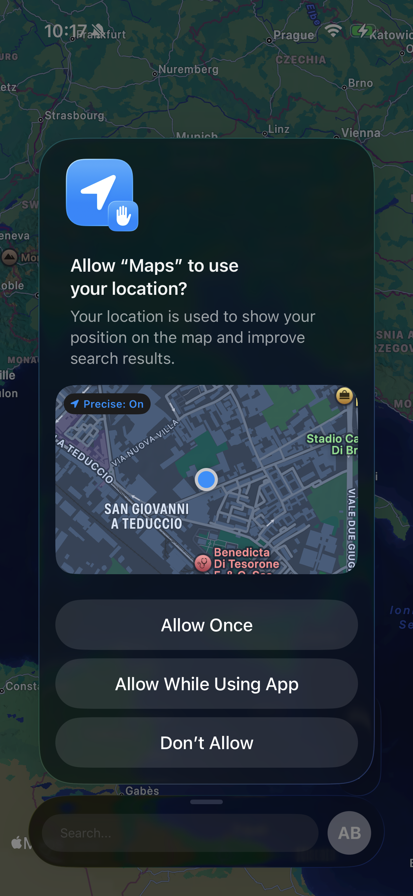
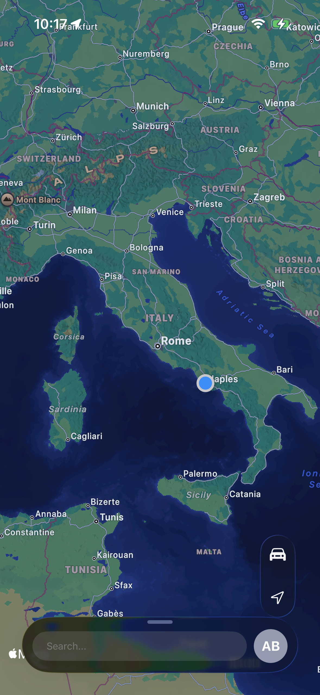

# Maps-from-Apple

A recreation of Apple’s Maps app, built as a learning project to understand how real-time location tracking works on iOS using Swift, SwiftUI, and MapKit.

  

## 🎯 Project Goal

This project was created to explore:
- How real-time user location tracking works  
- How to integrate **MapKit** in a SwiftUI application  
- How to manage permissions, updates, and map interactions  

The app replicates the core behavior of Apple Maps by displaying the user’s current position and allowing interaction with the map.

## ✨ Features

- Real-time user location tracking  
- Interactive map view with zoom and pan  
- Integration with MapKit  
- SwiftUI-based interface  

## 🛠 Technologies Used

- **Swift**
- **SwiftUI**
- **MapKit**
- **Xcode** (add version if needed, e.g., Xcode 15)
- **iOS target** (add minimum version, e.g., iOS 17)

## 🌟 Future Improvements

- Potential enhancements for expanding the project:
- Search for places or addresses
- Add map pins / annotations
- Route calculation and turn-by-turn navigation
- Map types (standard, satellite, transit)
- Improved UI with animations or custom controls
- Better error handling for location permissions

## 🚀 How to Run the Project

1. Clone the repository:
   ```bash
   git clone https://github.com/antimobucc/Maps-from-Apple.git
2. Open the project in xCode:
   MapsFromApple.xcodeproj
3. Choose a simulator or real device.  (Better if you choose one real device)
4. Run the project (⌘ + R).
5. Grant location permissions when requested.
